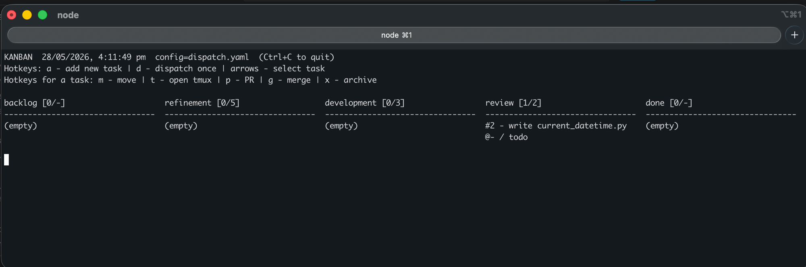

コンベヤ [konbeya], or **konby** for short — meaning "conveyor". Streamline teams of agents using kanban boards.

## Install

```bash
npm i -g @voronkovm/konby
```

**Running from a local clone?** Add the `bin/` directory to your shell PATH manually:

```bash
konby install [--shell zsh|bash]
```

For Codex sandbox runs, allow `konby` in `~/.codex/rules/default.rules`:

```
prefix_rule(pattern = ["konby"], decision = "allow")
```

## Usage

### 1. Create a board

```bash
konby board new <path> [--preset <name>] [--workspace <path>] [--force]
```

### 2. Adjust rules if needed

- Dispatching rules and column definitions: `<path>/dispatch.yaml`
- Agent roles: `<path>/agents/*.yaml`

### 3. Add tasks

```bash
# Add a task (stored as <path>/tasks/*.yml)
konby task add --title "..." [--board <path>]
```

### 4. Run the dispatcher

```bash
# Run once (nudge)
konby dispatch [--board <path>]

# Run continuously in background
konby dispatchd [--log-file <path>] [--board <path>]
```

### 5. Watch progress

```bash
konby board show [--board <path>]
```



Hotkeys:
- `a` — add new task
- `d` — dispatch once
- `↑↓←→` — select task
- `m` — move task
- `t` — open tmux session
- `p` — open GitHub PR
- `g` — merge branch
- `x` — archive task

### 6. Steer manually if needed
```bash
# Move or update a task
konby task move <task-file> [--column <column>] [--status <status>] \
  [--assignee <assignee>] [--comment "<comment>"] [--attachment <path>]

# Append a comment
konby task comment <task-file> "<comment>"
```

## Additional commands

```bash
# Open a GitHub PR for a task's workspace branch
konby task pr <task-file>

# Merge task branch into the repo's default branch locally
konby task merge <task-file>

# Manually start a tmux agent session for one task
konby session new --agent <agent-file> --task <task-file> [--board <path>]
```

## Examples

```bash
konby task add --title "Add OAuth login" --board ./my-board

konby task move ./my-board/tasks/10-login.yml \
  --column in_progress --status in_progress \
  --assignee coder --comment "Picked up for implementation"

konby task comment ./my-board/tasks/10-login.yml "Need clarification on acceptance criteria"

konby dispatchd --log-file /tmp/konby-dispatchd.log --board ./my-board
```

## Presets

Presets live under `presets/<preset-name>/`. The default preset is `swe`.

Each preset must contain:
- `dispatch.yaml`
- `task.schema.yaml`
- `agents/*.yaml`

## What `konby board new <path>` creates

- `tasks/` — task YAML files
- `agents/` — agent definitions
- `transcripts/` — session transcripts
- `dispatch.yaml` — dispatching rules
- `task.schema.yaml` — task field schema
- `agents/*.yaml` — agent configs from the selected preset
